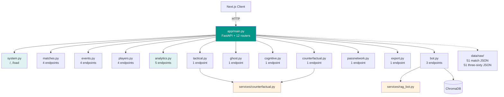

# ⚽ Euro 2024 Context Zone

> **Interactive tactical analysis platform powered by StatsBomb 360 data.**

A full-stack football analytics application that transforms passive viewers
into active tactical analysts. Built with FastAPI + Next.js, featuring
counterfactual simulation, cognitive pressure analysis, positional density,
and multivariate change-point detection.


---

## 📸 Screenshots

> _Add screenshots here after deployment — home, cognitive, tactical, pass network, player comparison_

| Home | Cognitive Mirror | Tactical Timeline |
|------|------------------|-------------------|
| _(placeholder)_ | _(placeholder)_ | _(placeholder)_ |

| Pass Network | Player Comparison | Counterfactual |
|--------------|-------------------|----------------|
| _(placeholder)_ | _(placeholder)_ | _(placeholder)_ |

---

## ✨ Features

### Core Analytics (6 Modules)

| # | Module | Description | Backend |
|---|--------|-------------|---------|
| 1 | 🧠 **Counterfactual Engine** | Monte Carlo simulation of alternative actions (`pass` / `shoot` / `dribble`). Computes ΔxG vs. actual event. | `GET /counterfactual/simulate` |
| 2 | 👁️ **Cognitive Mirror** | Decision Quality (DQ) scoring per event. 4 labels: Excellent / Neutral / Under Pressure / Mistake — based on opponent pressure + outcome. | `GET /cognitive/{match_id}` |
| 3 | 📍 **Position Density** | Spatial crowding score per detected player from 360 freeze-frames. Honest framing: position frequency, not stable identity tracking. | `GET /ghost/{match_id}` |
| 4 | 📜 **Tactical Timeline** | Rolling match-level stats (xG / PPDA / Field Tilt) + multivariate PELT change-point detection. | `GET /tactical/{match_id}` |
| 5 | 🔗 **Pass Network** | Player-to-player pass graph with average pitch positions from StatsBomb coordinates. | `GET /passnetwork/{match_id}` |
| 6 | 🆚 **Player Comparison** | Side-by-side radar + bar charts for 2–4 players, with cosine similarity. | `GET /players/compare` |

### Supporting Features

- 👥 **Player Explorer** — Sortable table of all 495+ Euro 2024 players, filter by team & metric.
- 📊 **Match Similarity** — Find matches with similar statistical patterns.
- 🧩 **Player Clustering** — K-Means clustering of players by playing style.
- 🤖 **Hudl Bot** — RAG-based chatbot over 187,924 events (FastAPI + ChromaDB).
- 🧪 **Public Data Lab** — Python REPL in browser via Pyodide (educational).

---

## 🛠️ Tech Stack

### Backend

- **Python 3.12** + **FastAPI** — REST API
- **Pandas** + **NumPy** — data manipulation
- **scikit-learn** — K-Means clustering, standardization
- **ruptures** — PELT change-point detection
- **SciPy** — Hungarian matching (`linear_sum_assignment`)
- **ChromaDB** — vector store for RAG bot
- **StatsBomb Open Data** — raw event data

### Frontend

- **Next.js 16** (App Router) + **React 19**
- **TypeScript** — type-safe end-to-end
- **Tailwind CSS** — utility-first styling, dark mode
- **Recharts** — radar / bar / line / area charts
- **SVG Canvas** — custom pitch visualization (pass network, position density)

### Data Pipeline

- 51 match JSON files (~3300 events each)
- 187,924 total events across Euro 2024
- 51 `three-sixty` frame files (~2882 frames each)

---

## 📁 Project Structure

```text
euro-2024/
├── app/                              # FastAPI backend
│   ├── main.py                       # App init + router registration (~1540 lines)
│   ├── routers/                      # 12 feature routers (28 endpoints)
│   │   ├── __init__.py
│   │   ├── bot.py                    # POST /bot/chat, GET /bot/health, POST /bot/reindex
│   │   ├── matches.py                # /matches, /matches/with360, /match/{id}/has360, /match/{id}/summary
│   │   ├── events.py                 # /events/{id}, /360/{uuid}, /avg_position, /debug/{uuid}
│   │   ├── players.py                # /players, /players/bulk, /player/{id}/summary, /player/{id}/breakdown
│   │   ├── analytics.py              # /teams, /compare/teams, /players/compare, /matches/similar, /players/clustering
│   │   ├── system.py                 # /, /load
│   │   ├── tactical.py               # /tactical/{id}     (PELT change points)
│   │   ├── ghost.py                  # /ghost/{id}        (position density)
│   │   ├── cognitive.py              # /cognitive/{id}    (Decision Quality)
│   │   ├── counterfactual.py         # /counterfactual/simulate (Monte Carlo)
│   │   ├── passnetwork.py            # /passnetwork/{id}  (pass graph)
│   │   └── export.py                 # /export/csv
│   ├── core/
│   │   └── config.py                 # DATA_DIR paths
│   ├── data/
│   │   └── loader.py                 # StatsBomb download + cache
│   └── services/
│       ├── counterfactual.py         # Monte Carlo engine
│       └── rag_bot.py                # Hudl Bot (ChromaDB RAG)
│
├── data/raw/                         # Cached StatsBomb data
│   ├── all_events.json
│   ├── matches.json
│   ├── match_{id}.json
│   └── three-sixty/
│       └── {match_id}.json
│
├── tests/
│   ├── __init__.py
│   └── test_smoke.py                 # 20 smoke tests (all endpoints)
│
├── frontend/                         # Next.js app
│   ├── app/
│   │   ├── page.tsx                  # Home
│   │   ├── cognitive/[matchId]/      # Cognitive Mirror
│   │   ├── tactical/[id]/            # Tactical Timeline
│   │   ├── ghost/[id]/               # Position Density
│   │   ├── passnetwork/[matchId]/    # Pass Network
│   │   ├── player/[id]/              # Player detail
│   │   ├── player-comparison/        # Compare players
│   │   ├── counterfactual/           # Counterfactual engine
│   │   ├── players/                  # Player explorer
│   │   ├── clusters/                 # K-Means clusters
│   │   ├── match-similarity/         # Match similarity
│   │   ├── match/[id]/               # Match detail
│   │   ├── bot/                      # Hudl Bot UI
│   │   ├── lab/                      # Pyodide data lab
│   │   └── components/               # Navbar, Footer, etc.
│   ├── lib/
│   │   └── api.ts                    # Typed API client
│   └── package.json
│
├── conftest.py                       # pytest config (sys.path root)
├── pytest.ini                        # pytest settings
├── README.md
├── AUDIT_REPORT.md                   # Engineering audit trail
├── .env.example
└── requirements.txt
```

### Backend Architecture



---

## 🚀 Getting Started

### Prerequisites

- Python 3.11+ (tested on 3.12)
- Node.js 20+
- Git

### 1. Clone & Install

```bash
git clone <your-repo-url>
cd euro-2024

# Backend
python -m venv venv
source venv/Scripts/activate   # Windows: .\venv\Scripts\activate
pip install -r requirements.txt

# Frontend
cd frontend
npm install
cd ..
```

### 2. Load Data

Data is downloaded on first backend startup. Ensure `data/raw/` contains:

- `all_events.json`
- `matches.json`
- `three-sixty/{match_id}.json`
- `match_{match_id}.json`

To force re-download from StatsBomb Open Data, access `GET /load`.

### 3. Run Backend

```bash
source venv/Scripts/activate
uvicorn app.main:app --reload
# → http://127.0.0.1:8000
```

Verify:

```bash
curl http://127.0.0.1:8000/
# {"status":"online","data_loaded":true,"total_events":187924}
```

### 4. Run Frontend

```bash
cd frontend
npm run dev
# → http://localhost:3000
```

### 5. Environment Variables (optional)

Copy `.env.example` to `.env` and adjust:

```bash
NEXT_PUBLIC_API_BASE=http://127.0.0.1:8000
```

### 6. Run Tests (optional)

```bash
pytest tests/ -v
# 20 passed
```

---

## 🔌 API Endpoints

### System — `system.py`

| Method | Endpoint | Description |
|--------|----------|-------------|
| GET | `/` | Health check + total events |
| GET | `/load` | Force reload from StatsBomb Open Data |

### Matches — `matches.py`

| Method | Endpoint | Description |
|--------|----------|-------------|
| GET | `/matches` | List all matches |
| GET | `/matches/with360` | Matches with 360 freeze-frames |
| GET | `/match/{match_id}/has360` | Check if match has 360 data |
| GET | `/match/{match_id}/summary` | Scoreline + xG summary |

### Events — `events.py`

| Method | Endpoint | Description |
|--------|----------|-------------|
| GET | `/events/{match_id}` | Full event stream (filterable by type) |
| GET | `/360/{event_uuid}` | Freeze-frame positions for one event |
| GET | `/avg_position` | Average pitch position per player |
| GET | `/debug/{event_uuid}` | Raw event dict (NaN-sanitized) |

### Players — `players.py`

| Method | Endpoint | Description |
|--------|----------|-------------|
| GET | `/players` | All players (filterable by match/team) |
| GET | `/players/bulk` | Bulk stats (cached) |
| GET | `/player/{player_id}/summary` | Player season summary |
| GET | `/player/{player_id}/breakdown` | Per-match breakdown |

### Analytics — `analytics.py`

| Method | Endpoint | Description |
|--------|----------|-------------|
| GET | `/teams` | All teams (cached) |
| GET | `/compare/teams?team_ids=1,2` | Head-to-head team comparison |
| GET | `/players/compare?ids=1,2,3` | Compare 2–4 players |
| GET | `/matches/similar/{match_id}` | Similar matches |
| GET | `/players/clustering?n_clusters=4` | K-Means clusters |

### Advanced Analytics

| Method | Endpoint | Router |
|--------|----------|--------|
| GET | `/counterfactual/simulate` | `counterfactual.py` |
| GET | `/cognitive/{match_id}` | `cognitive.py` |
| GET | `/ghost/{match_id}` | `ghost.py` |
| GET | `/tactical/{match_id}` | `tactical.py` |
| GET | `/passnetwork/{match_id}` | `passnetwork.py` |

### Export & Bot

| Method | Endpoint | Description |
|--------|----------|-------------|
| GET | `/export/csv` | CSV export (matches / players / events / summary) |
| POST | `/bot/chat` | Chat with Hudl Bot |
| GET | `/bot/health` | Bot status + indexed events |
| POST | `/bot/reindex` | Rebuild vector store |

**Total: 28 endpoints across 12 routers**

---

## 🎓 Data Source & Credits

- **StatsBomb Open Data** — [github.com/statsbomb/open-data](https://github.com/statsbomb/open-data)
- Licensed for public use. All event data (xG, freeze-frames, coordinates) comes from StatsBomb.
- Euro 2024 tournament data: 51 matches, 187,924 events.

---

## 🧪 Testing & Code Quality

- **Smoke tests**: 20 endpoints covered by `tests/test_smoke.py`.
- **Audit trail**: See [`AUDIT_REPORT.md`](./AUDIT_REPORT.md) for the full engineering audit log.
- **Router split**: `main.py` refactored from 2523 → 1543 lines (12 routers).
- All critical logic (Monte Carlo, cognitive scoring, PELT) verified against StatsBomb domain standards.

Run tests:

```bash
pytest tests/ -v
```

---

## 📝 License

MIT License — see [LICENSE](./LICENSE) for details.

Data © StatsBomb — used under their Open Data terms.

---

## 🤝 Contributing

This is a portfolio project. Suggestions welcome via issues.

---

**Built with** ❤️ **using StatsBomb Open Data, FastAPI, and Next.js.**# euro-2024

