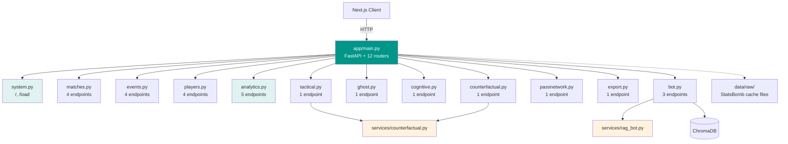

# ⚽ Euro 2024 Context Zone

> **Interactive tactical analysis platform powered by StatsBomb 360 data.**

A full-stack football analytics application that transforms passive viewers
into active tactical analysts. Built with FastAPI + Next.js, featuring
counterfactual simulation, cognitive pressure analysis, positional density,
and multivariate change-point detection.


---

---

## ✨ Features

### Core Analytics (6 Modules)

| # | Module | Description | Backend |
|---|--------|-------------|---------|
| 1 | 🧠 **Counterfactual Engine** | Monte Carlo simulation of alternative actions (`pass` / `shoot` / `dribble`). Computes ΔxG vs. actual event. | `GET /counterfactual/simulate` |
| 2 | 👁️ **Cognitive Mirror** | Decision Quality (DQ) scoring per event. 4 labels: Excellent / Neutral / Under Pressure / Mistake — based on opponent pressure + outcome. | `GET /cognitive/{match_id}` |
| 3 | 📍 **Position Density** | Spatial crowding score per detected player from 360 freeze-frames. Honest framing: position frequency, not stable identity tracking. | `GET /ghost/{match_id}` |
| 4 | 📜 **Tactical Timeline** | Rolling match-level stats (xG / PPDA / Field Tilt) + multivariate PELT change-point detection. | `GET /tactical/{match_id}` |
| 5 | 🔗 **Pass Network** | Player-to-player pass graph with average pitch positions from StatsBomb coordinates. | `GET /passnetwork/{match_id}` |
| 6 | 🆚 **Player Comparison** | Side-by-side radar + bar charts for 2–4 players, with cosine similarity. | `GET /players/compare` |

### Supporting Features

- 👥 **Player Explorer** — Sortable table of all 495+ Euro 2024 players, filter by team & metric.
- 📊 **Match Similarity** — Find matches with similar statistical patterns.
- 🧩 **Player Clustering** — K-Means clustering of players by playing style.
- 🤖 **Hudl Bot** — RAG-based chatbot over 187,924 events (FastAPI + ChromaDB).
- 🧪 **Public Data Lab** — Python REPL in browser via Pyodide (educational).

---

## 🛠️ Tech Stack

### Backend

- **Python 3.12** + **FastAPI** — REST API
- **Pandas** + **NumPy** — data manipulation
- **scikit-learn** — K-Means clustering, standardization
- **ruptures** — PELT change-point detection
- **SciPy** — Hungarian matching (`linear_sum_assignment`)
- **ChromaDB** — vector store for RAG bot
- **StatsBomb Open Data** — raw event data

### Frontend

- **Next.js 16** (App Router) + **React 19**
- **TypeScript** — type-safe end-to-end
- **Tailwind CSS** — utility-first styling, dark mode
- **Recharts** — radar / bar / line / area charts
- **SVG Canvas** — custom pitch visualization (pass network, position density)

### Data Pipeline

- 51 match JSON files (~3300 events each)
- 187,924 total events across Euro 2024
- 51 `three-sixty` frame files (~2882 frames each)

---

## 📁 Project Structure

```text
euro-2024/
├── app/                              # FastAPI backend
│   ├── main.py                       # App init, lifespan, and router registration
│   ├── routers/                      # 12 feature routers (28 endpoints)
│   │   ├── __init__.py
│   │   ├── bot.py                    # POST /bot/chat, GET /bot/health, POST /bot/reindex
│   │   ├── matches.py                # /matches, /matches/with360, /match/{id}/has360, /match/{id}/summary
│   │   ├── events.py                 # /events/{id}, /360/{uuid}, /avg_position, /debug/{uuid}
│   │   ├── players.py                # /players, /players/bulk, /player/{id}/summary, /player/{id}/breakdown
│   │   ├── analytics.py              # /teams, /compare/teams, /players/compare, /matches/similar, /players/clustering
│   │   ├── system.py                 # /, /load
│   │   ├── tactical.py               # /tactical/{id}     (PELT change points)
│   │   ├── ghost.py                  # /ghost/{id}        (position density)
│   │   ├── cognitive.py              # /cognitive/{id}    (Decision Quality)
│   │   ├── counterfactual.py         # /counterfactual/simulate (Monte Carlo)
│   │   ├── passnetwork.py            # /passnetwork/{id}  (pass graph)
│   │   └── export.py                 # /export/csv
│   ├── core/
│   │   └── config.py                 # DATA_DIR paths
│   ├── data/
│   │   └── loader.py                 # StatsBomb download + cache
│   └── services/
│       ├── counterfactual.py         # Monte Carlo engine
│       └── rag_bot.py                # Hudl Bot (ChromaDB RAG)
│
├── data/raw/                         # Cached StatsBomb data
│   ├── all_events.json
│   ├── matches.json
│   ├── match_{id}.json
│   └── three-sixty/
│       └── {match_id}.json
│
├── tests/                            # Unit tests and data-backed API smoke tests
│
├── frontend/                         # Next.js app
│   ├── app/
│   │   ├── page.tsx                  # Home
│   │   ├── cognitive/[matchId]/      # Cognitive Mirror
│   │   ├── tactical/[id]/            # Tactical Timeline
│   │   ├── ghost/[id]/               # Position Density
│   │   ├── passnetwork/[matchId]/    # Pass Network
│   │   ├── player/[id]/              # Player detail
│   │   ├── player-comparison/        # Compare players
│   │   ├── counterfactual/           # Counterfactual engine
│   │   ├── players/                  # Player explorer
│   │   ├── clusters/                 # K-Means clusters
│   │   ├── match-similarity/         # Match similarity
│   │   ├── match/[id]/               # Match detail
│   │   ├── bot/                      # Hudl Bot UI
│   │   ├── lab/                      # Pyodide data lab
│   │   └── components/               # Navbar, Footer, etc.
│   ├── lib/
│   │   └── api.ts                    # Typed API client
│   └── package.json
│
├── conftest.py                       # pytest config (sys.path root)
├── pytest.ini                        # pytest settings
├── README.md
├── AUDIT_REPORT.md                   # Engineering audit trail
├── .env.example
└── requirements.txt
```

### Backend Architecture



---

## Deployment

### Deployment layout

- Vercel serves the Next.js application from the `frontend/` root directory.
- Railway serves the FastAPI backend from the repository root using `Dockerfile`.
- Attach a Railway volume at `/app/data`. Set `DATA_DIR=/app/data/raw` and
  `CHROMA_DB_PATH=/app/data/chroma_db` so downloaded StatsBomb files and the
  ChromaDB index survive container restarts.
- Use Upstash Redis for the shared API cache. Set `REDIS_URL` only on the
  Railway backend. The cache module uses the process-local cache in development
  and requires Redis when `APP_ENV=production`.
- Keep the LLM connection server-side. Set `OLLAMA_HOST` in Railway to an
  Ollama endpoint that has the configured `qwen2.5:3b` model available.

The root `Dockerfile` is used for the Railway backend and local backend runs.
`docker-compose.yml` is for local development and is not a Vercel deployment
configuration. Vercel builds the Next.js project directly.

### Environment variables

| Variable | Development | Railway production | Vercel production/preview |
| --- | --- | --- | --- |
| `APP_ENV` | `development` | `production` | Not used |
| `BACKEND_INTERNAL_URL` | Local FastAPI origin | Not used | Railway backend origin, server-only |
| `NEXT_PUBLIC_API_BASE` | `/api` | Not used | `/api` |
| `CORS_ORIGINS` | `http://localhost:3000` | Empty; requests use the same-origin proxy | Not used |
| `CACHE_API_KEY` | Dummy local value from `.env.example` | Strong secret | Not used |
| `REDIS_URL` | Empty for process-local cache | Upstash Redis TLS URL | Not used |
| `DATA_DIR` | `data/raw` | `/app/data/raw` | Not used |
| `CHROMA_DB_PATH` | `data/chroma_db` | `/app/data/chroma_db` | Not used |
| `OLLAMA_HOST` | Local Ollama endpoint | Reachable Ollama service endpoint | Not used |

Set actual service URLs and secrets in each provider's environment settings.
Never put `BACKEND_INTERNAL_URL`, `REDIS_URL`, `CACHE_API_KEY`, or LLM
credentials in a `NEXT_PUBLIC_*` variable. Vercel preview deployments should
use a staging Railway backend when available; sharing the production backend
means preview data and operations affect production.

### GitHub to Vercel

1. Push the reviewed deployment branch to GitHub. Connect the repository to a
   Vercel project and set **Root Directory** to `frontend`. Leave the Next.js
   framework preset and build settings on auto-detect.
2. Add `BACKEND_INTERNAL_URL` and `NEXT_PUBLIC_API_BASE=/api` separately for
   Production, Preview, and Development. Preview should use staging if
   available. Development uses the local values in `frontend/.env.example`.
3. Pull request branches receive Preview deployments. Merges or pushes to the
   repository's configured production branch create Production deployments.
4. After adding or changing variables, redeploy so the Next.js rewrite is
   rebuilt with the new backend origin.

No `vercel.json` is required. Vercel detects Next.js from the `frontend`
project root, and `frontend/next.config.ts` owns the API rewrite and response
headers.

### Railway backend setup

1. Create a Railway service from the same GitHub repository. Use the repository
   root as the service root so Railway finds the root `Dockerfile`.
2. Attach a persistent volume mounted at `/app/data`.
3. Set the production variables from the table above. Set `CACHE_API_KEY` to a
   generated secret and `REDIS_URL` to the Upstash TLS connection URL.
4. Deploy the service, then run `python -m app.data.loader` once in the Railway
   service shell to populate the volume. This downloads the StatsBomb data and
   may take several minutes. Stop the API before indexing, back up the mounted
   `/app/data` volume, then run `python index_bot.py` in the service shell to
   generate the ChromaDB embeddings. Indexing deletes the existing collection
   before rebuilding it, so do not run it during normal API startup or while
   the API is using the collection.
5. Set the Railway public service origin as Vercel's server-only
   `BACKEND_INTERNAL_URL`. Do not include a path or credentials.

The backend exposes `/` as its health endpoint. `GET /load` is protected by
`X-API-Key`; use it only for an intentional data reload. API requests from the
browser go to the same-origin `/api` route on Vercel, then the Next.js server
forwards them to Railway. Backend CORS therefore stays restricted instead of
allowing `*`.

### Local deployment checks

Copy `.env.example` to `.env` and `frontend/.env.example` to
`frontend/.env.local`. Start FastAPI and Next.js separately. To run Redis
locally, set `REDIS_URL` to the local Redis service; leave it empty to use the
process-local cache.

## 🚀 Getting Started

### Prerequisites

- Python 3.12
- Node.js 20+
- Git

### 1. Clone & Install

```bash
git clone <your-repo-url>
cd euro-2024

# Backend (PowerShell)
py -3.12 -m venv .venv
.\.venv\Scripts\Activate.ps1
python -m pip install -r requirements.txt

# Frontend
cd frontend
npm ci
cd ..
```

Create the local environment file and set a private cache administration key:

```powershell
Copy-Item .env.example .env
# Edit .env and set CACHE_API_KEY to a unique secret.
```

The `.env` file is for the backend. The frontend calls `/api`, which Next.js
proxies to `BACKEND_INTERNAL_URL` (default `http://127.0.0.1:8000`).
If the backend runs elsewhere, copy `frontend/.env.example` to
`frontend/.env.local` and change `BACKEND_INTERNAL_URL` there.

### 2. Load Data

Start the backend and request `GET /load` once to download StatsBomb Open Data
into `data/raw/`. This may take several minutes. The cache is local and is not
committed to Git.

### 3. Run Backend

```bash
uvicorn app.main:app --reload
# → http://127.0.0.1:8000
```

Verify:

```bash
curl http://127.0.0.1:8000/
# {"status":"online","data_loaded":true,"total_events":187924}
```

### 4. Run Frontend

```bash
cd frontend
npm run dev
# → http://localhost:3000
```

### 5. Run Tests

```bash
python -m pytest -q
cd frontend
npm test
npm run lint
npm run typecheck
```

The data-backed API smoke tests are skipped when `data/raw/all_events.json` is
not present. Unit tests and frontend checks run without the dataset.

---

## 🔌 API Endpoints

### System — `system.py`

| Method | Endpoint | Description |
|--------|----------|-------------|
| GET | `/` | Health check + total events |
| GET | `/load` | Force reload from StatsBomb Open Data |

### Matches — `matches.py`

| Method | Endpoint | Description |
|--------|----------|-------------|
| GET | `/matches` | List all matches |
| GET | `/matches/with360` | Matches with 360 freeze-frames |
| GET | `/match/{match_id}/has360` | Check if match has 360 data |
| GET | `/match/{match_id}/summary` | Scoreline + xG summary |

### Events — `events.py`

| Method | Endpoint | Description |
|--------|----------|-------------|
| GET | `/events/{match_id}` | Full event stream (filterable by type) |
| GET | `/360/{event_uuid}` | Freeze-frame positions for one event |
| GET | `/avg_position` | Average pitch position per player |
| GET | `/debug/{event_uuid}` | Raw event dict (NaN-sanitized) |

### Players — `players.py`

| Method | Endpoint | Description |
|--------|----------|-------------|
| GET | `/players` | All players (filterable by match/team) |
| GET | `/players/bulk` | Bulk stats (cached) |
| GET | `/player/{player_id}/summary` | Player season summary |
| GET | `/player/{player_id}/breakdown` | Per-match breakdown |

### Analytics — `analytics.py`

| Method | Endpoint | Description |
|--------|----------|-------------|
| GET | `/teams` | All teams (cached) |
| GET | `/compare/teams?team_ids=1,2` | Head-to-head team comparison |
| GET | `/players/compare?ids=1,2,3` | Compare 2–4 players |
| GET | `/matches/similar/{match_id}` | Similar matches |
| GET | `/players/clustering?n_clusters=4` | K-Means clusters |

### Advanced Analytics

| Method | Endpoint | Router |
|--------|----------|--------|
| GET | `/counterfactual/simulate` | `counterfactual.py` |
| GET | `/cognitive/{match_id}` | `cognitive.py` |
| GET | `/ghost/{match_id}` | `ghost.py` |
| GET | `/tactical/{match_id}` | `tactical.py` |
| GET | `/passnetwork/{match_id}` | `passnetwork.py` |

### Export & Bot

| Method | Endpoint | Description |
|--------|----------|-------------|
| GET | `/export/csv` | CSV export (matches / players / events / summary) |
| POST | `/bot/chat` | Chat with Hudl Bot |
| GET | `/bot/health` | Bot status + indexed events |
| POST | `/bot/reindex` | Rebuild vector store |
| POST | `/admin/cache/invalidate` | Invalidate cached data (requires `X-API-Key`) |

**Total: 29 endpoints across 12 routers**

---

## 🎓 Data Source & Credits

- **StatsBomb Open Data** — [github.com/statsbomb/open-data](https://github.com/statsbomb/open-data)
- Licensed for public use. All event data (xG, freeze-frames, coordinates) comes from StatsBomb.
- Euro 2024 tournament data: 51 matches, 187,924 events.

---

## 🧪 Testing & Code Quality

- **Backend tests**: unit tests plus data-backed endpoint smoke tests in `tests/`.
- **Frontend tests**: Vitest tests for the API client and chatbot response/error flow.
- **CI**: GitHub Actions runs tests, lint, typecheck, build, and secret scanning.
- **Audit trail**: See [`AUDIT_REPORT.md`](./AUDIT_REPORT.md) for the full engineering audit log.
- **Router split**: API functionality is organized across 12 routers.

Run backend tests:

```bash
pytest tests/ -v
```

### Run with Docker Compose

Set `CACHE_API_KEY` in the environment to a unique value, then run:

```powershell
docker compose up --build
```

The web app is available at `http://localhost:3000`, and the API at
`http://localhost:8000`. To start the optional local chatbot model service:

```powershell
docker compose --profile bot up --build -d
docker compose exec ollama ollama pull qwen2.5:3b
```

The first chatbot request downloads the embedding model. The bot also needs
the Ollama model above. The app's analytics do not require either service.

---

## 📝 License

MIT License — see [LICENSE](./LICENSE) for details.

Data © StatsBomb — used under their Open Data terms.

---

## 🤝 Contributing

This is a portfolio project. Suggestions welcome via issues.

---

**Built with** ❤️ **using StatsBomb Open Data, FastAPI, and Next.js.**# euro-2024


## Known Limitations

- Chatbot tidak menjawab sebagian pertanyaan berdata. Retrieval mengembalikan
  8 dokumen, tetapi LLM fallback ke "Tidak ada data". Perbaikan dijadwalkan
  pada iterasi berikutnya.
- Docker indexing belum diverifikasi end-to-end karena Docker CLI tidak
  tersedia di lingkungan pengembangan. Wajib diverifikasi sebelum deploy
  Production.
- Audit dependency produksi bersih. Audit penuh melaporkan 5 high pada
  rantai ESLint (dev-only), tidak memengaruhi runtime produksi.
- Vite config memakai ESM di file yang dibaca sebagai CommonJS. Warning
  non-fatal saat ini; akan menjadi error pada Vite versi berikutnya.
